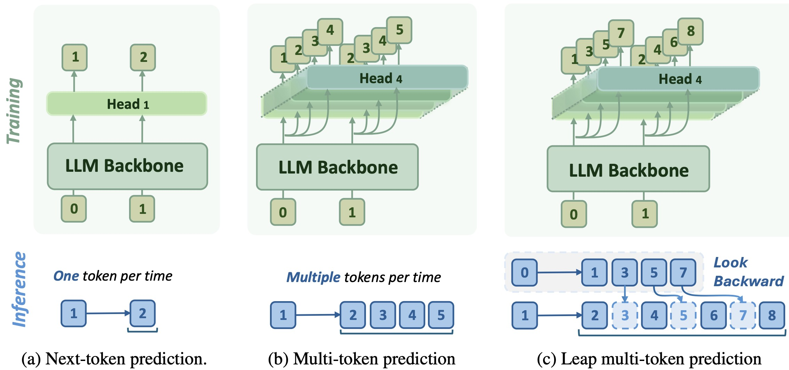

<div align=center>

<h1><a color="red" href="https://arxiv.org/pdf/2505.17505">L-MTP: Leap Multi-Token Prediction Beyond Adjacent Context for Large Language Models</a></h1>


<h5 align="center">
<div>
      Xiaohao Liu<sup>1</sup>,
      Xiaobo Xia<sup>1</sup>, 
      Weixiang Zhao<sup>2</sup>,
      Manyi Zhang<sup>3</sup>,
      Xianzhi Yu<sup>4</sup>,
      Xiu Su<sup>5</sup>,
      Shuo Yang<sup>2</sup>,
      See-Kiong Ng<sup>1</sup>,
      Tat-Seng Chua<sup>1</sup>
</div>
<div>
  <sup>1</sup>National University of Singapore, <sup>2</sup>Harbin Institute of Technology, <sup>3</sup>Tsinghua University, <sup>4</sup>Chinese Academy of Sciences, <sup>5</sup>Central South University
</div>   
</h5>
</div>



<h4 align="center">An extendable MTP paradigm with <i>leaping</i> capability for both training and inference.</h4>

Large Language Models (LLMs) are typically trained and deployed using Next-Token Prediction (NTP), an inherently sequential process that limits contextual coverage and inference efficiency. To address this, we propose **Leap Multi-Token Prediction (L-MTP)**, an innovative method that extends Multi-Token Prediction (MTP) by strategically skipping intermediate tokens to predict non-adjacent future tokens in a single forward pass. L-MTP enhances the model's ability to capture long-range dependencies and enables a specialized decoding strategy that significantly accelerates inference.

## Update

- (**2025/10/13**) The checkpoints of L-MTP are released [HF Link](https://huggingface.co/xiao-hao/L-MTP).
- (**2025/09/19**) L-MTP is accepted by NeurIPS 2025.
- (**2025/09/19**) The code and dataset of L-MTP are released [HF Link](https://huggingface.co/datasets/xiao-hao/self-distillation-LLMs).
- (**2025/05/23**) The preprint of L-MTP is on [arXiv](https://arxiv.org/pdf/2505.17505).


## Usage

### Training

L-MTP training follows a two-stage process:

1.  **Head Warm-up:** Freeze the LLM backbone and train the additional prediction heads using self-distillation data.

Example command for training Gemma3 12B:
```bash
cd LLaMA-Factory
CUDA_VISIBLE_DEVICES=1,2,3,4 FORCE_TORCHRUN=1 llamafactory-cli train ../configs/s1/gemma_12B_sft_lmtp_stage1.yaml
```

2.  **Full Model Tuning:** Fine-tune the entire model (backbone + heads) using the curated dataset.

Example command for training Gemma3 12B:
```bash
CUDA_VISIBLE_DEVICES=1,2,3,4 FORCE_TORCHRUN=1 llamafactory-cli train ../configs/s2/gemma_12B_sft_lmtp_stage2.yaml
```

### Inference

For inference, load a trained L-MTP model and use the provided decoding script. The model will automatically use the backward-looking strategy for efficient generation.

Evaluate the model in NTP mode (this mode is quite compatible with recent evaluation framework, e.g., lm-evaluation-harness and MathRuler) by exporting first. 
```bash
CUDA_VISIBLE_DEVICES=4,7 llamafactory-cli export ../configs/merge/gemma3_12B_base_lmtp_stage2.yaml
```

You can also integrate L-MTP decoding method (see implemetation in `models/lmtp/model:backward_decode`) into existing MTP models like Medusa with less prediction heads.

---

## Models & Datasets

The paper evaluates L-MTP on a diverse set of base LLMs: **Qwen 2.5** (3B, 7B), **Llama 3.2** (3B), **Llama 3.1** (8B), and **Gemma 3** (4B, 12B).

Training datasets are curated from:  **Math** (Hendrycks et al.), **Evol-Instruct-Code** (Luo et al., Chaudhary) and **Alpaca-GPT4** (Peng et al.). You can go through our dataset in `LLaMA-Factory/data:dataset_info.json` and [link](https://huggingface.co/datasets/xiao-hao/self-distillation-LLMs).


---

## Citation

If you find this work useful, please cite our paper:

```bibtex
@article{lmtp,
  title={L-MTP: Leap Multi-Token Prediction Beyond Adjacent Context for Large Language Models},
  author={Liu, Xiaohao and Xia, Xiaobo and Zhao, Weixiang and Zhang, Manyi and Yu, Xianzhi and Su, Xiu and Yang, Shuo and Ng, See-Kiong and Chua, Tat-Seng},
  journal={arXiv preprint arXiv:2505.17505},
  year={2025}
}
```

<div align=center>
<h3>🌟 Empower your LLMs to predict farther and generate faster with L-MTP! 🌟</h3>
</div>